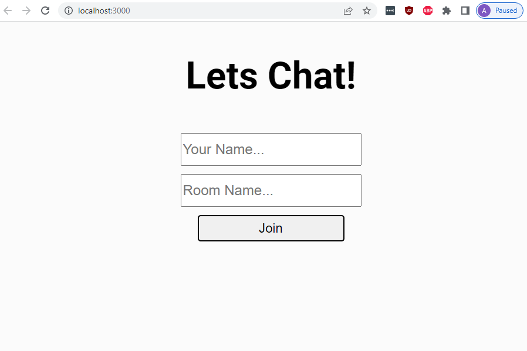
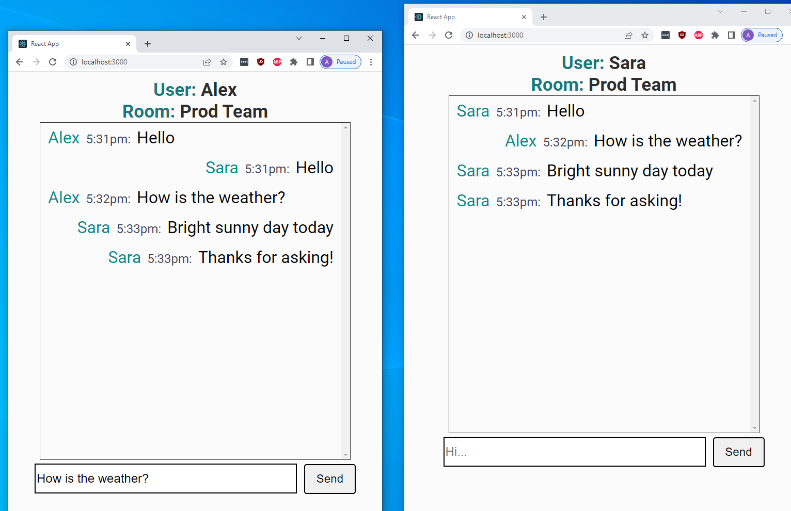

<br />
<p align="center">
  <h1 align="center">Lets Chat! - Simple Messenger App</h1>
  
  <p align="center">
    Simple messenger application
    <br /><br />
  </p>
</p>

<h2 style="display: inline-block">Table of Contents</h2>
<ol>
  <li>
    <a href="#about">About</a>
    <ul>
      <li><a href="#features">Features</a></li>
      <li><a href="#project-stack">Project Stack</a></li>
    </ul>
  </li>
  <li>
    <a href="#getting-started">Getting Started</a>
    <ul>
      <li><a href="#prerequisites">Prerequisites</a></li>
      <li><a href="#installation">Installation</a></li>
    </ul>
  </li>
  <li><a href="#usage">Usage</a></li>
  <li><a href="#feature-improvements">Feature Improvements</a></li>
</ol>

## About

### Features

- Basic one-on-one and group messaging

### Project Stack

- React
- Socket.io
- Typescript
- Context API

## Getting Started

To start follow these simple steps below:

### Prerequisites

Install latest version of yarn or npm

- yarn (or npm)

### Installation

1. After cloning the project, install packages
   ```sh
   yarn install
   then
   yarn install:cs
   ```
2. To start the development server
   ```sh
   yarn start
   ```

### Test

1. To test
   ```sh
   yarn test
   ```

## Usage

**Open browsers**


1. Open separate browsers by entering local development server url at http://localhost:3000

**Enter name and room**

1. Enter different names for the different logins.
2. Enter same room name.

**Chat**


1. Start chatting away!
   <br /><br />

## Issues and Limitations

- Message will not clear input field upon sending the message(require manual delete)

## Feature Improvements

- Notes:

  - List of things that can be improved

    - Error handling
    - Use environment variables (process.env)
    - Responsive design layout (mobile friendly, etc)
    - Style enhancements

<br />

- Future implementation to consider
  - Authentication
  - DB integration
